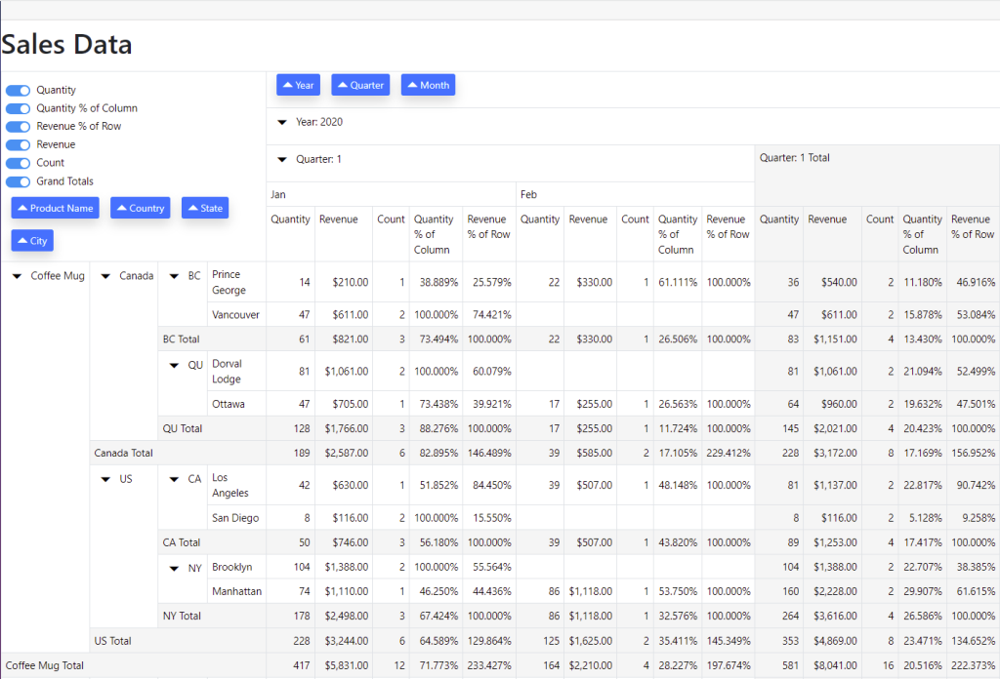
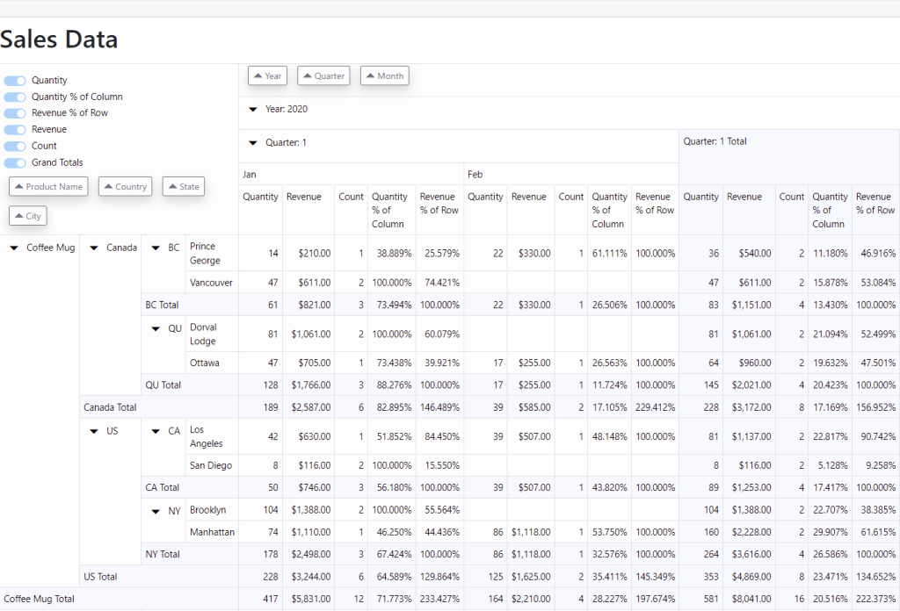
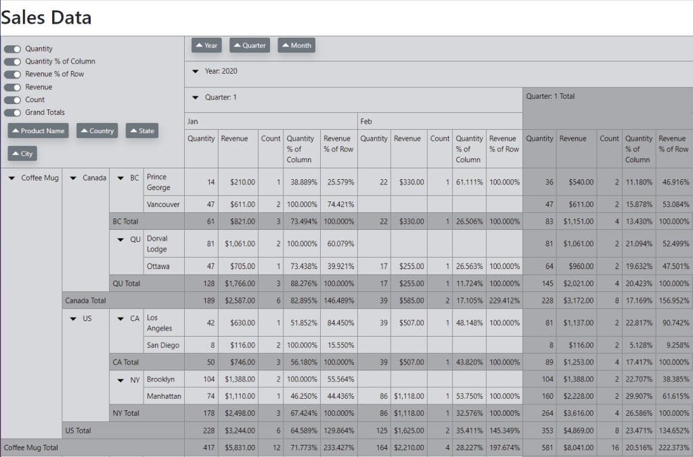
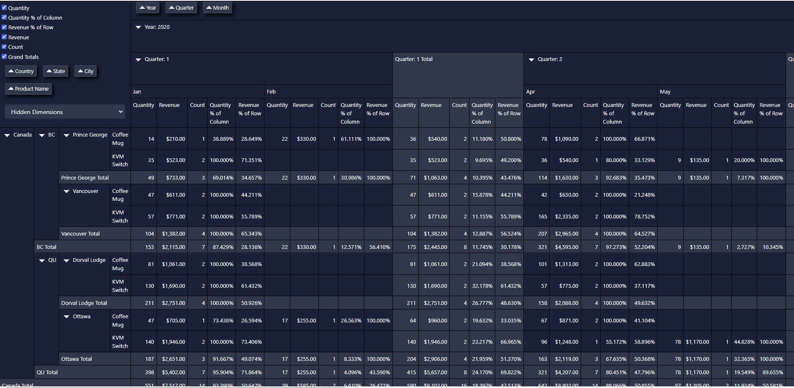

# Blazor Demo Application for LeaderPivot

LeaderPivot.Blazor is an easy to use pivot table control for Blazor applications.  

This demo application showcases some of the features of LeaderPivot and provides a copy/paste template you can use to implement the control in your app.  

Click the Controls button in the upper right corner of the page to customize the look of the control.  

Dimension buttons can be dragged within an axis or across axis to re-dimension the displayed data.  Clicking a dimension buttons toggles the sort direction for that dimension.  

Included color themes - you can customize as needed:

Primary

---

Light

---

Secondary

---

Dark

---

---

[LeaderPivot.Blazor code repository](https://github.com/leaderanalytics/LeaderPivot.Blazor)

[Get the LeaderPivot.Blazor NuGet package](https://www.nuget.org/packages/LeaderAnalytics.LeaderPivot.Blazor/)